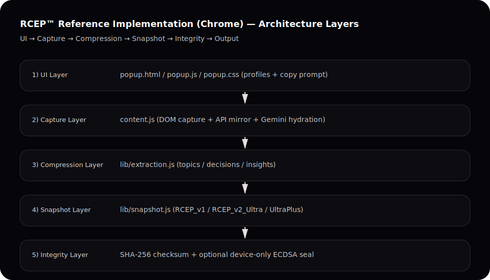

  
  <h1>RL4 Snapshot Extension (Chrome)</h1>
  
<strong>RCEP™ Reference Implementation</strong>

Chrome extension that captures Claude / ChatGPT / Gemini conversations and generates **RCEP™ context packages** for cross‑LLM continuity (Compact / Ultra / Ultra+), with SHA‑256 checksum + optional device-only Integrity Seal.

This repo is a **public-friendly reference implementation** of the RCEP™ payload format. It does not include any IDE / kernel components.

## Why this exists (research-grade framing)
RCEP™ packages encode *portable cognitive state*:
- **Topics** (what the session is about)
- **Decisions** (what was chosen + why, as observable)
- **Timeline** (macro phases)
- **Integrity** (checksum + optional seal)
- **Epistemic honesty** (explicit “unverified semantics” when transcript is omitted)

## Diagrams

## Protocol docs
- `docs/DESIGN_SYSTEM.md` (frozen visual language)
- `docs/WHITEPAPER.md` (conceptual + threat model)
- `docs/SPECIFICATION.md` (normative MUST/SHOULD)
- `docs/SECURITY_MODEL.md` (what is / isn’t guaranteed)
- `schemas/` (JSON Schema by profile)
- `examples/` (example payloads)

## Installation

1. Open Chrome → `chrome://extensions/`
2. Enable **Developer mode**
3. Click **Load unpacked**
4. Select the `rl4-snapshot-extension` folder

## Usage

1. Open a conversation on Claude / ChatGPT / Gemini
2. Click **Generate Context**
3. Check Messages / Compression / Checksum
4. Click **Copy Prompt to Clipboard**
5. Paste into any other LLM and continue

## Related repos

- **[RCEP-Protocol](https://github.com/Soynido/RCEP-Protocol)**: RCEP™ spec + examples + reference implementation.

## Notes

- DOM selectors can change when providers update their UI.
- “Integrity Seal” is **device-only** (offline). It detects edits; it does not prove human identity.

## License

MIT

